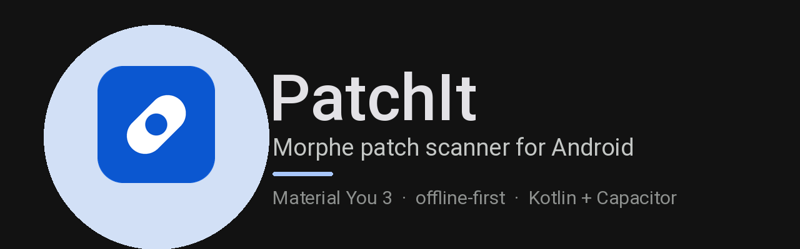

<p align="center">
  
</p>

<p align="center">
  <a href="https://github.com/d3ffen/patchit/releases/latest"></a>
  
  
  
  
  
</p>

PatchIt scans the apps on your Android device and shows which of them the
[Morphe](https://github.com/MorpheApp/morphe-patcher) patch ecosystem can actually
patch — then hands the covering patch sources to Morphe Manager. It never patches
anything itself.

---

## Features

- **Scans installed apps** — version name and code, split APKs, signing
  certificate, install dates, APK size, all via `PackageManager`.
- **Checks compatibility** — compares your build against every source's declared
  targets, by `versionCode` first and version name second. Verdicts are
  `supported`, `experimental`, `untested`, `too new`, `too old` or `no patches`,
  computed per source.
- **Covers community patches** — the official list is 166 patches across 3 apps;
  the community index adds 222 bundles, ~4,100 patches and **964 packages**.
- **Works offline** — both indexes cached locally, with a bundled snapshot so a
  first launch with no network still finds 966 packages.
- **Sets Morphe up** — sends the covering repositories to Morphe Manager through
  its real `add-source` deep link. Sources are offered even when they don't match
  your build, so you can update or downgrade and come back.
- **Material You 3** — wallpaper-derived colour, alternate palettes, AMOLED black,
  themed launcher icon.
- **Explains itself** — a 500-entry diagnostics log with every registry warning.

---

## Build

**Requirements:** Node 20+, JDK 21, Android SDK with platform 35 and build-tools 35.

```bash
npm install
npm run dev              # browser preview, no device needed
npm run build            # web bundle
npm run build:release    # web bundle without source maps or console logs
npx cap sync android
cd android && ./gradlew assembleDebug
```

Two more scripts worth knowing:

```bash
npm run verify:registry  # runs the data pipeline against the live indexes
npm run verify:theme     # measures every colour pair for WCAG contrast
```

---

## Permissions

- `QUERY_ALL_PACKAGES` — required to enumerate installed apps, which is the whole
  point of the app. Without it Android 11+ only exposes a handful of packages.
- `INTERNET` — fetching the patch indexes.

## Licence

GPL-3.0. Releases are signed with a self-generated key — certificate SHA-256
`3e8c7cc9effaf575f54c61ceff035b98d52634b9e134a68f73d28074e65ed9cd`.

Not affiliated with the Morphe project. Only add patch sources you trust — a patch
source decides what ends up inside your patched apps.
